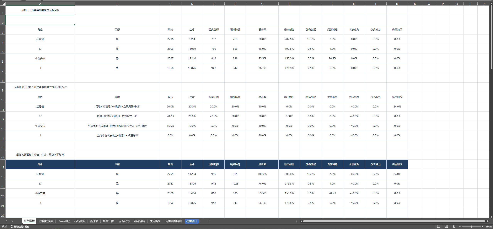
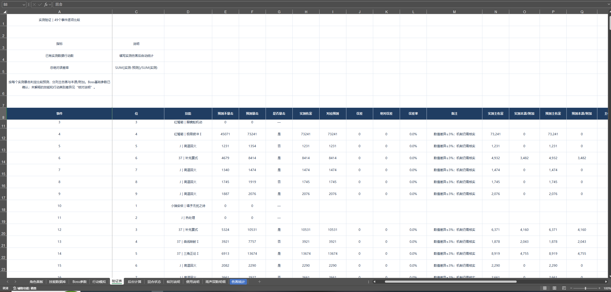
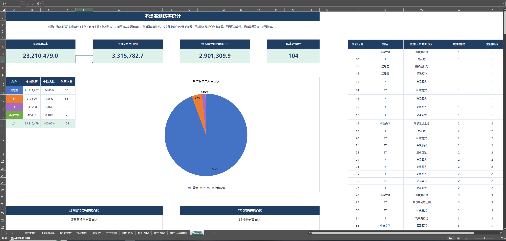
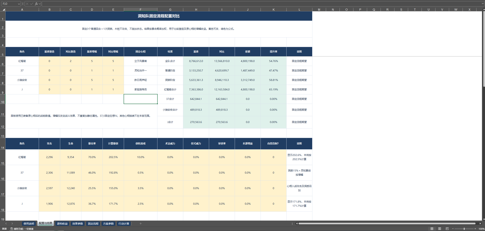

# 《重返未来：1999》战斗伤害建模与配置收益分析工具

基于 Excel 独立构建的战斗伤害模拟与配置收益分析工具。

通过拆解角色属性、技能倍率、心相效果、Boss 机制及动态战斗状态，建立可进行实战验证的伤害模型，并进一步用于不同塑造、心相增幅及角色配置下的收益比较。

> 📊 [下载实战伤害验证工具（Excel）](./files/damage-simulator-demo.xlsx)
> ｜ 📈 [下载配置收益分析工具（Excel）](./files/configuration-analysis-demo.xlsx)

## 项目成果

- 独立完成战斗伤害计算模型与行动状态模拟逻辑
- 对 **104 项实战伤害**进行逐项预测与验证
- 累计核对实战伤害 **23,210,479（约 2,321 万）**
- 最终模型对已记录的 104 项伤害均实现整数伤害值一致
- 在验证模型基础上进一步开发参数化配置收益分析工具

---

## 1. 项目背景

《重返未来：1999》的战斗伤害受到角色面板、技能倍率、暴击、增伤 / 减伤、动态增益、行动顺序及特殊战斗阶段等多种因素共同影响。

本项目主要尝试解决两个问题：

1. **能否建立一套能够复现实战伤害结果的计算模型？**
2. **在统一战斗环境和行动序列下，如何量化不同塑造、心相增幅及角色配置的实际收益？**

项目整体流程：

**机制整理 → 数值建模 → 状态模拟 → 实战采样 → 误差定位 → 专项测试 → 模型修正 → 配置收益分析**

---

## 2. 伤害模型

首先对角色、技能、敌方属性及战斗机制进行拆解，将影响伤害结果的变量整理为可计算参数。

模型主要包括：

- 角色攻击及基础面板
- 技能倍率
- 敌方防御
- 暴击相关参数
- 威力相关增益
- 创伤加成
- 伤害减免
- 现实 / 精神 / 本源伤害
- 特殊技能及阶段修正

同时建立角色基础数值与入战 Buff 的独立参数区域，将原始面板、战斗增益与最终入战面板分离，便于后续进行参数调整及误差定位。

### 模型界面

---

## 3. 战斗状态模拟

由于实际战斗中的伤害并非只由静态面板决定，因此进一步建立按行动更新的状态模拟逻辑。

主要处理：

- Buff 叠层及持续时间
- 状态触发与结算顺序
- 反击与追击
- 额外回合
- 目击机制
- 弱点洞穿阶段
- 不同行动之间的状态继承与更新

因此模型并非仅计算单次静态技能伤害，而是能够按照预设行动序列，对完整战斗流程中的角色状态与伤害进行逐步计算。

---

## 4. 实战验证与误差定位

为验证模型准确性，记录实际游戏战斗过程，并将模型预测结果与实测伤害逐项比较。

验证数据包括：

| 指标 | 数量 |
| --- | ---: |
| 主线回合 | 7 |
| 额外回合 | 1 |
| 洞穿阶段 | 2 |
| 实测伤害记录 | 104 项 |
| 累计核对伤害 | 23,210,479 |

### 验证流程

**预测伤害 → 实战记录 → 对比误差 → 定位可能影响变量 → 设计专项测试 → 修正计算逻辑 → 再次验证**

对于出现差异的项目，针对技能倍率、暴击精度、效果结算时点等因素进行专项测试，通过控制变量定位误差来源，并根据验证结果修正模型。

### 实测验证界面

验证表逐项记录技能、暴击状态、实测伤害、对应预测、绝对误差及误差率，用于检查模型输出并定位异常结果。

### 验证结果

在最终采用的计算规则下，模型对已记录的 **104 项实战伤害均实现整数伤害值一致**。

累计核对实战伤害：

**23,210,479**

---

## 5. 伤害统计与结果分析

在完成逐项伤害验证的基础上，对战斗结果进行进一步汇总，用于观察队伍及角色层面的伤害结构。

统计指标包括：

- 实测总伤害
- 主线回合 DPR
- 计入额外回合后的 DPR
- 各角色伤害占比
- 各角色伤害次数
- 技能伤害构成
- 回合及行动来源

### 伤害统计界面

在本次验证样本中：

- 实测总伤害：**23,210,479**
- 主线 7 回合 DPR：**3,315,782.7**
- 计入额外回合后的 DPR：**2,901,309.9**
- 共记录伤害行动：**104 项**

通过将模型预测、实战验证和结果统计连接起来，使模型不仅能够回答“单次伤害是多少”，也能够进一步分析完整战斗中的伤害来源及角色贡献。

---

## 6. 配置收益分析

在伤害模型完成实战验证后，进一步开发独立的参数化配置收益分析工具。

可调整变量包括：

- 角色基础面板
- 0–5 塑造
- 心相增幅
- Boss 固定属性
- 部分效果参数

在保持敌方属性与行动序列一致的情况下，通过控制变量比较不同配置下的：

- 总伤害
- DPR
- 角色伤害占比
- 技能伤害占比
- 绝对伤害差
- 相对提升率

### 配置收益分析界面

例如，可固定相同敌方属性与行动流程，仅改变角色塑造或心相增幅，计算不同配置之间的总伤害差及提升率，从而将角色养成收益转化为可量化的对比结果。

---

## 7. 作品文件

### 实战伤害验证工具

📊 **[下载实战伤害验证工具（Excel）](./files/damage-simulator-demo.xlsx)**

主要包含：

- 角色面板及技能数据库
- Boss 参数
- 行动模拟
- 回合状态
- 后台伤害计算
- 实战验证表
- 伤害统计与可视化

展示版保留主要模型结构及验证结果，部分底层计算区域已进行保护。

---

### 配置收益分析工具

📈 **[下载配置收益分析工具（Excel）](./files/configuration-analysis-demo.xlsx)**

主要用于：

- 调整角色基础面板
- 调整角色塑造
- 调整心相增幅
- 固定行动流程进行配置对比
- 计算不同配置的总伤害及提升率

展示版开放部分参数输入区域，可直接进行配置调整与结果比较。

---

## 8. 项目说明

- 本项目为个人学习及游戏数值分析作品，与《重返未来：1999》官方无关。
- 游戏相关名称及素材版权归原权利方所有。
- 项目中的分析模型基于公开游戏表现及个人实测结果整理。
- Excel 展示版仅开放部分参数输入区域，部分底层计算区域已进行保护。
- 本项目主要用于个人求职作品展示及数值策划能力说明。
